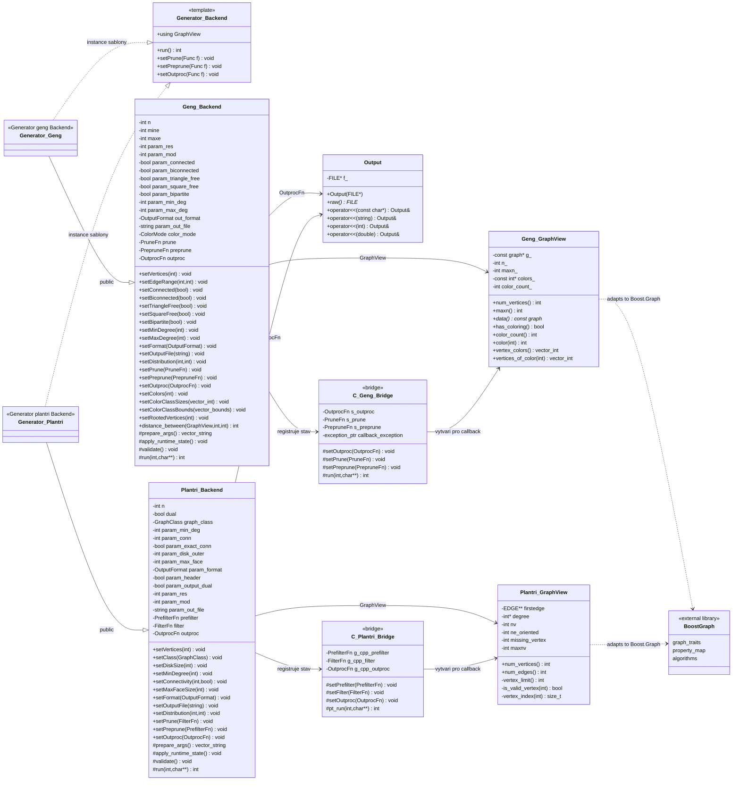

# Programatorska dokumentace

Vnitrni navrh knihovny PlanG. Uzivatelska dokumentace je samostatne v souboru `README.md`.

PlanG poskytuje C++20 rozhrani nad puvodnimi C generatory `geng` z baliku nauty a `plantri` (u `geng` bylo do puvodniho generatoru zaroven doplneno vlastni rozsireni). Cilem neni generatory prepsat, ale zapouzdrit jejich pouziti do jednotneho API, ktere umoznuje konfiguraci, filtrovani a zpracovani generovanych grafu.

## Architektura

Knihovna je rozdelena do nekolika vrstev:

| Vrstva | Soubory | Ucel |
| --- | --- | --- |
| Verejne C++ API | `include/MyGraphLib.hpp`, `include/common/Generator.hpp` | vstupni bod knihovny a sablona `Generator<Backend>` |
| Backend API | `include/geng/GengAPI.hpp`, `include/plantri/PlantriAPI.hpp` | konfigurace jednotlivych generatoru a prevod konfigurace na argumenty |
| Pohled na graf | `include/geng/GraphView.hpp`, `include/plantri/GraphView.hpp` | read-only pohled na aktualne generovany graf |
| Boost integrace | `include/*/GraphViewBoost.hpp`, `include/*/GraphViewFunctions.hpp` | funkce a typy potrebne pro pouziti Boost.Graph algoritmu |
| C++ bridge | `src/geng/geng_api.cpp`, `src/plantri/plantri_api.cpp` | registrace C++ callbacku do C generatoru |
| C shim | `src/geng/geng_shim.c`, `src/plantri/plantri_shim.c` | nizkourovnove propojeni s puvodnimi C zdroji |
| Puvodni generatory | `vendor/nauty`, `vendor/plantri` | zdrojove kody tretich stran |

Tok spusteni:

1. Uzivatel vytvori `Generator<geng::Backend>` nebo `Generator<plantri::Backend>`.
2. Pomoci setteru nastavi parametry generovani.
3. `Generator::run()` zavola `prepare_args()`, ktere sestavi argumenty pro puvodni C generator.
4. `apply_runtime_state()` zaregistruje aktualni callbacky a pomocny stav do C vrstvy.
5. Backend zavola puvodni C generator.
6. C generator behem generovani vola zaregistrovane callbacky, ktere predaji uzivateli `GraphView`.

## UML diagram trid

V diagramu `+` znamena verejne API urcene pro uzivatele knihovny, `#` znamena vnitrni metodu pouzivanou tridou `Generator` nebo bridge vrstvou a `-` znamena vnitrni stav.



## Zapouzdreni a sprava stavu

Konfigurace generatoru je ulozena v instanci backendu. To znamena, ze dve ruzne instance `Generator<geng::Backend>` mohou mit rozdilne nastaveni a lze je spustit postupne v jednom procesu.

Puvodni C generatory ale stale pouzivaji globalni stav. Proto se tento stav aplikuje az tesne pred volanim `run()` metodou `apply_runtime_state()`. Paralelni behy stejneho backendu nejsou podporovane.

Dulezite hranice zapouzdreni:

| Cast | Zapouzdreni |
| --- | --- |
| `Generator<Backend>` | sjednocuje spusteni a predava praci backendu |
| `geng::Backend`, `plantri::Backend` | drzi konfiguraci konkretni instance; doporucene pouziti je pres setter metody |
| `Output` | soukrome drzi `FILE* f_` a poskytuje pouze jednoduche vypisovaci operatory |
| `GraphView` | poskytuje read-only view na graf bez vlastnictvi dat |
| C++ bridge | propojuje C++ API s původními C generátory a skrývá technické detaily callbacků |

Backendy jsou v kodu definovane jako `class`. Konfiguracni atributy jsou private a public API je postavene na setter metodach, ktere provadeji validaci a pripravu konfigurace.

## Verejne API

Hlavni vstupni soubor je:

```cpp
#include "MyGraphLib.hpp"
```

Ten pripojuje spolecne API, oba backendy, Boost.Graph integraci a konstanty:

```cpp
constexpr int KEEP = 0;
constexpr int PRUNE = 1;
```

### Generator

`Generator<Backend>` je sablonova trida, ktera dedi z predaneho backendu. Diky tomu ma generator stejne metody jako konkretni backend a navic spolecnou metodu `run()`.

```cpp
Generator<geng::Backend> app;
app.setVertices(10);
app.setConnected();
app.run();
```

Spolecne metody:

| Metoda | Popis |
| --- | --- |
| `run()` | sestavi argumenty, aplikuje runtime stav a spusti backend |
| `setPrune(f)` | nastavi filtr grafu |
| `setPreprune(f)` | nastavi predcasny filtr behem generovani |
| `setOutproc(f)` | nastavi vlastni zpracovani vystupu |

### Callbacky

Callbacky se predavaji jako `std::function` nebo lambda funkce.

| Callback | Backend | Vychozi vyznam |
| --- | --- | --- |
| `setPrune` | `geng`, `plantri` | rozhodne, jestli se graf ponecha |
| `setPreprune` | `geng`, `plantri` | rozhodne, jestli ma smysl pokracovat v rozpracovane vetvi |
| `setOutproc` | `geng`, `plantri` | vlastni zpracovani nalezeneho grafu |

Navratove hodnoty filtru:

| Hodnota | Vyznam |
| --- | --- |
| `KEEP` | graf nebo vetev se ponecha |
| `PRUNE` | graf nebo vetev se zahodi |

U backendu `geng` jsou vyjimky z uzivatelskych callbacku zachyceny v C++ trampoline funkci. Vyjimka neprojde pres C kod a po navratu z `geng_run()` se znovu vyhodi v C++ vrstve. U backendu `plantri` jsou callbacky take obalene `try/catch`, aby vyjimka neprosla pres C kod.

## Backend `geng`

`geng::Backend` slouzi pro obecne neorientovane grafy. Konfigurace se uklada v instanci backendu a metoda `prepare_args()` ji prevadi na argumenty odpovidajici puvodnimu prikazu `geng`.

Vybrane metody:

| Metoda | Vyznam |
| --- | --- |
| `setVertices(n)` | pocet vrcholu |
| `setEdgeRange(min, max)` | rozsah poctu hran |
| `setConnected()` | pouze souvisle grafy |
| `setBiconnected()` | pouze 2-souvisle grafy |
| `setTriangleFree()` | zakaz trojuhelniku |
| `setSquareFree()` | zakaz ctyrcyklu |
| `setBipartite()` | pouze bipartitni grafy |
| `setMinDegree(d)` | dolni mez stupne |
| `setMaxDegree(d)` | horni mez stupne |
| `setRegular()` | regulární grafy |
| `setChordal()` | chordalni grafy |
| `setSplit()` | split grafy |
| `setPerfect()` | perfektni grafy |
| `setClawFree()` | grafy bez indukovaneho drapu |
| `setFormat(...)` | vystupni format |
| `setNoOutput()` | vypne vystup |
| `setOutputFile(path)` | vystup do souboru |
| `setDistribution(res, mod)` | rozdeleni vypoctu |
| `setColors(count)` | pocet rozlisenych barev bez pevnych velikosti trid |
| `setColorClassSizes(...)` | presne velikosti barevnych trid |
| `setColorClassBounds(...)` | intervaly velikosti barevnych trid |
| `setRootedVertices(count)` | zakotvene vrcholy pomoci barev |

Validace vstupu probiha pri volani setteru a pred sestavenim argumentu.

### Obarvene grafy v backendu `geng`

Do puvodniho generatoru `geng` bylo doplneno rozsireni pro generovani grafu vzhledem k barevnym tridam vrcholu. Cilem neni pouze ulozit barvy do vystupu, ale zahrnout je primo do kanonickeho generovani. Izomorfismus tedy musi zachovat barvy: vrcholy stejne barvy se mohou permutovat mezi sebou, ale vrcholy ruznych barev ne.

Verejne C++ API poskytuje nekolik zpusobu zadani barev:

| Metoda | Interni vyznam |
| --- | --- |
| `setColorClassSizes({4, 2})` | presne velikosti barevnych trid; interně odpovida intervalum `4..4` a `2..2` |
| `setColorClassBounds({{2, 4}, {1, 3}})` | dolni a horni meze velikosti kazde tridy |
| `setColors(k)` | `k` rozlisenych barev, kazda s mezemi `1..n` |
| `setRootedVertices(k)` | specialni pripad barevnych trid `{n-k, 1, 1, ..., 1}` |

Barvy jsou rozlisene. Rozklady `{1, 3}` a `{3, 1}` tedy predstavuji ruzna zadani, protoze barva 0 a barva 1 maji vlastni identitu.

Obarveni bylo doplneno do souboru `vendor/nauty/nauty2_9_1/geng.c`. Stav barev je ulozen v globalnich polich generatoru:

| Promenna | Vyznam |
| --- | --- |
| `geng_vertex_color_count` | pocet aktivnich barev |
| `geng_vertex_color_lower[]` | dolni meze velikosti barevnych trid |
| `geng_vertex_color_upper[]` | horni meze velikosti barevnych trid |
| `geng_current_vertex_color[]` | aktualni barva kazdeho vrcholu v rozpracovanem grafu |
| `geng_current_color_size[]` | aktualni pocty vrcholu v jednotlivych barvach |
| `geng_canonical_vertex_color[]` | barvy po kanonickem preznačení vystupniho grafu |

Pri rozsirovani grafu se kromě mnoziny sousedu noveho vrcholu zkousi take jeho barva. Zjednoduseny prubeh je:

```text
extend(graf G na n vrcholech):
    pro kazdou pripustnou mnozinu sousedu noveho vrcholu:
        pokud obarveni neni aktivni:
            pokracuj puvodnim algoritmem geng

        pokud obarveni je aktivni:
            pro kazdou barvu c:
                prirad novemu vrcholu barvu c
                zvys aktualni pocet vrcholu v barve c

                pokud lze jeste splnit dolni a horni meze barev:
                    proved accept test s partition rozdelenou podle barev
                    pokud test projde:
                        pokracuj rekurzivne

                vrat prirazeni barvy zpet
```

Realizovatelnost barev hlida funkce `colour_assignment_feasible()`. Zadna trida nesmi prekrocit horni mez a zaroven musi platit, ze ze zbyvajicich vrcholu lze jeste splnit vsechny dolni meze.
Presne velikosti trid jsou jen specialnim pripadem intervalu, kde dolni mez odpovida horni mezi.


Pri zapnutem `setCanonicalLabeling()` se kanonicky preznači nejen graf, ale i pole barev.

Obarveni je doplneno i do vetve `spaextend()`.


Do C++ vrstvy se barvy predavaji pres `geng::GraphView`. V `setPrune` a `setPreprune` ukazuje `GraphView` na aktualni rozpracovane barvy. V `setOutproc` ukazuje na vystupni barvy, tedy po pripadnem kanonickem preznačení. Dostupne metody jsou `has_coloring()`, `color_count()`, `color(v)`, `vertex_colors()` a `vertices_of_color(color)`.

## Backend `plantri`

`plantri::Backend` slouzi pro rovinné grafy a specializovane tridy grafu podporovane programem `plantri`.

Vybrane metody:

| Metoda | Vyznam |
| --- | --- |
| `setVertices(n)` | pocet vrcholu |
| `setClass(...)` | typ generovanych rovinných grafu |
| `setDiskSize(n)` | triangulace disku s vnejsi stenou velikosti `n` |
| `setMinDegree(d)` | minimalni stupen |
| `setConnectivity(c, exact)` | konektivita |
| `setMaxFaceSize(f)` | maximalni velikost steny |
| `setFormat(...)` | vystupni format |
| `setNoOutput()` | vypne vystup |
| `setOutputFile(path)` | vystup do souboru |
| `setOutputDual()` | vypis dualnich grafu |
| `setOrientationPreserving()` | jedna reprezentace pro orientacni tridu |
| `setFullGroup()` | vypocet cele automorfismove grupy |
| `setNonTrivialGroup()` | pouze grafy s netrivialni grupou |
| `setDistribution(res, mod)` | rozdeleni vypoctu |
| `setSplitLevel(level)` | uroven splitu |

`GraphClass` urcuje rezim plantri:

| Hodnota | Vyznam |
| --- | --- |
| `Trinagulation` | triangulace, vychozi rezim |
| `Quadrangulation` | kvadrangulace |
| `GeneralQuad` | obecne kvadrangulace |
| `SimplePlane` | jednoduche rovinné grafy |
| `Bipartite` | bipartitni rovinné grafy |
| `Eulerian` | eulerovske rovinné grafy |
| `Disk` | triangulace disku |
| `Apollonian` | apolloniovske grafy |

## GraphView a prace s grafem

`GraphView` je read-only pohled na graf ulozeny uvnitr puvodniho C generatoru. Data nekopiruje. To je dulezite pro vykon, protoze generatory mohou vytvaret velke mnozstvi grafu.

Z toho plyne:

1. `GraphView` je platny pouze behem callbacku.
2. Uzivatel nesmi predpokladat, ze pointery uvnitr `GraphView` zustanou platne po dalsim kroku generatoru.

Oba backendy poskytují funkce ve stylu Boost.Graph:

| Funkce | Vyznam |
| --- | --- |
| `vertices(g)` | iterace pres vrcholy |
| `edges(g)` | iterace pres hrany |
| `out_edges(v, g)` | incidentni hrany vrcholu |
| `adjacent_vertices(v, g)` | sousedi vrcholu |
| `num_vertices(g)` | pocet vrcholu |
| `num_edges(g)` | pocet hran |
| `source(e, g)` | pocatecni vrchol hrany |
| `target(e, g)` | koncovy vrchol hrany |
| `out_degree(v, g)` | stupen vrcholu |

Backend `plantri` navic pracuje s half-edge reprezentaci a poskytuje funkce jako `next_edge`, `prev_edge` a `opposite_edge`.

## Integrace Boost.Graph

Knihovna Boost.Graph neni pouzita jako uloziste grafu. PlanG nevytvari kopii grafu do datove struktury z Boostu, ale prispusobuje vlastni `GraphView` tak, aby splnoval rozhrani ocekavane algoritmy Boost.Graph.

Integrace je rozdelena do tri casti:

| Soubor | Ucel |
| --- | --- |
| `include/geng/GraphView.hpp`, `include/plantri/GraphView.hpp` | definuji typy potrebne pro `boost::graph_traits`, napriklad `vertex_descriptor`, `edge_descriptor`, iteratory, kategorie grafu a typy velikosti |
| `include/geng/GraphViewFunctions.hpp`, `include/plantri/GraphViewFunctions.hpp` | definuji free funkce `vertices`, `edges`, `out_edges`, `adjacent_vertices`, `source`, `target`, `num_vertices`, `num_edges` a `out_degree` |
| `include/geng/GraphViewBoost.hpp`, `include/plantri/GraphViewBoost.hpp` | doplnuji `boost::property_map` pro `boost::vertex_index_t` |

Boost.Graph pouziva sablonu `boost::graph_traits<Graph>`, aby zjistil, jake typy ma dany graf. Proto `GraphView` obsahuje typy jako:

```cpp
using vertex_descriptor = int;
using edge_descriptor = ...;
using vertex_iterator = ...;
using edge_iterator = ...;
using directed_category = boost::undirected_tag;
using traversal_category = ...;
```

Algoritmy Boost.Graph pak volaji standardni free funkce jako `vertices(g)`, `out_edges(v, g)` , `source(e, g)`. Tyto funkce jsou definovane ve stejnem namespace jako konkretni `GraphView`.

U backendu `geng` jsou hrany cteny z bitove reprezentace grafu z knihovny nauty. Napriklad `out_degree` pouziva interni radek matice sousednosti a pocita nastavene bity pomoci `POPCOUNT`, aby nebylo nutne prochazet vsechny iteratory hran.

U backendu `plantri` je graf reprezentovan half-edge strukturou `EDGE`. Proto `edge_descriptor` obsahuje ukazatel na orientovanou hranu a funkce `next_edge`, `prev_edge` a `opposite_edge` umoznuji prochazet planarni ulozeni grafu. Pro `vertex_index_t` je pouzita vlastni `vertex_index_map`, protoze plantri muze pracovat s chybejicim vrcholem (`missing_vertex`) a indexy vrcholu se proto nemusi shodovat primo s poradim `0..n-1`.

Diky teto adaptaci lze nad grafy z obou generatoru pouzit standardni algoritmy z Boost.Graph.

Podrobné definice jednotlivých konceptů viz oficiální dokumentace Boost.Graph:
https://www.boost.org/doc/libs/latest/libs/graph/doc/graph_concepts.html

## Rozsiritelnost

API je navrzene tak, aby `Generator` nebyl pevne svazany s jednim konkretnim generatorem. Novy backend musi splnit stejnou minimalni smlouvu jako `geng::Backend` a `plantri::Backend`:

```cpp
struct NewBackend
{
    using GraphView = ...;

    std::vector<std::string> prepare_args() const;
    void apply_runtime_state() const;

    void setPrune(...);
    void setPreprune(...);
    void setOutproc(...);

    static int run(int argc, char** argv);
};
```

Pro pridani noveho backendu je typicky potreba:

1. vytvorit `GraphView`, ktery popisuje graf v pameti generatoru,
2. dodat funkce kompatibilni s Boost.Graph, pokud ma byt mozne pouzivat Boost algoritmy,
3. vytvorit backend tridu s konfiguracnimi metodami,
4. napsat C nebo C++ bridge pro registraci callbacku,
5. pridat hlavicku backendu do `MyGraphLib.hpp`.

Protoze `Generator<Backend>` pouziva backend jako sablonovy parametr, pridani noveho backendu nevyzaduje zmenu samotne tridy `Generator`.

## Pouzite navrhove vzory

| Vzor | Pouziti v projektu |
| --- | --- |
| Adapter / Wrapper | C generatory `geng` a `plantri` jsou obaleny C++ rozhranim |
| Bridge | C shim a C++ API oddeluji puvodni C kod od verejneho C++ API |
| Strategy | Uzivatelske callbacky `setPrune`, `setPreprune`, `setOutproc` meni chovani generovani |
| Adapter pro Boost.Graph | `GraphView` typy jsou prizpusobene rozhrani Boost.Graph pomoci traits, property map a volnych funkci |
| Policy-based design | `Generator<Backend>` dostava backend jako sablonovy parametr |
| Facade | `MyGraphLib.hpp` slouzi jako jednotny vstupni bod knihovny |
